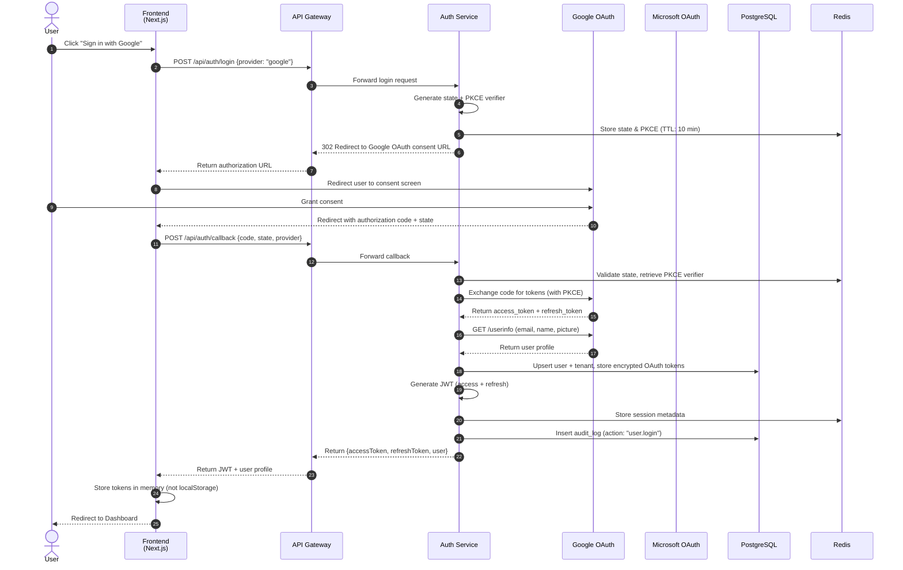
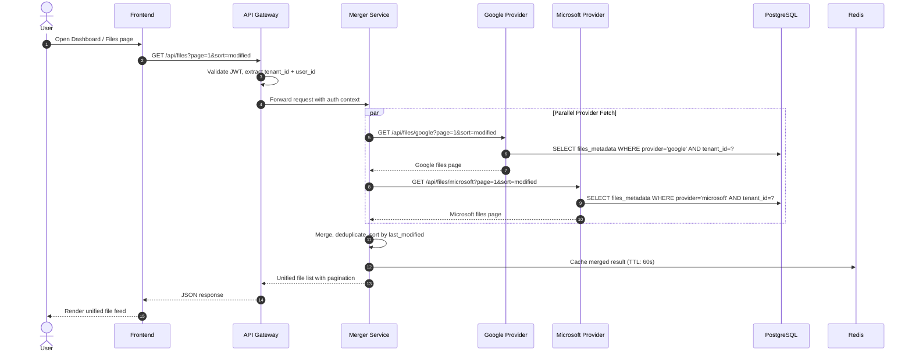
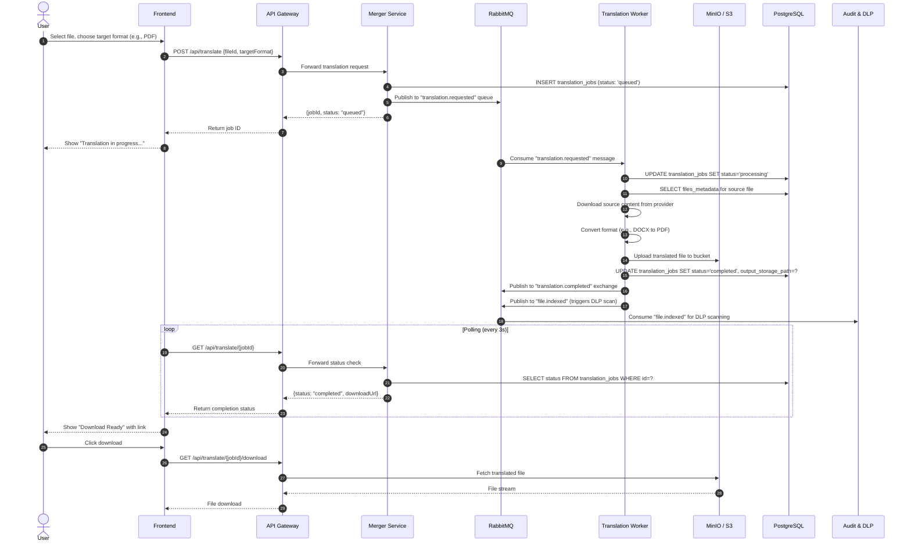
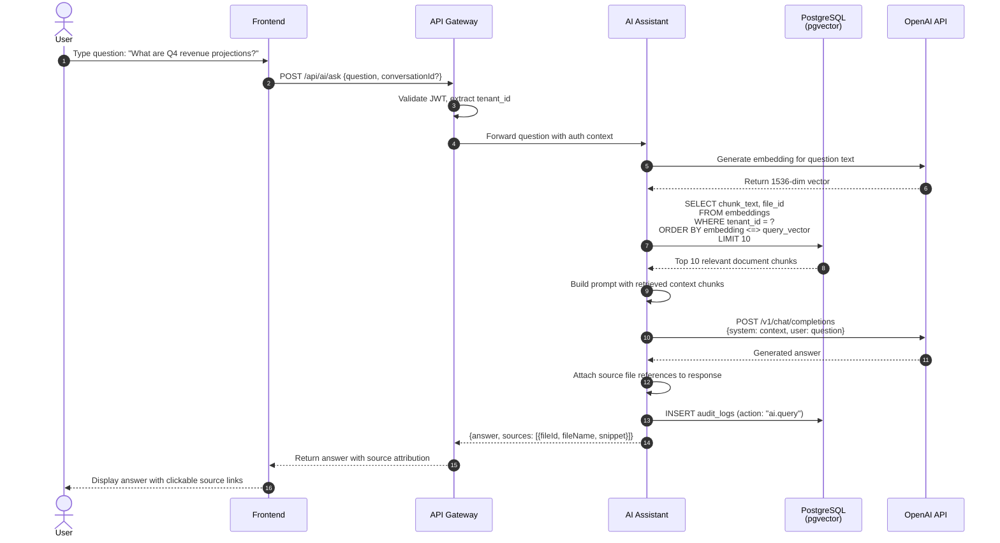
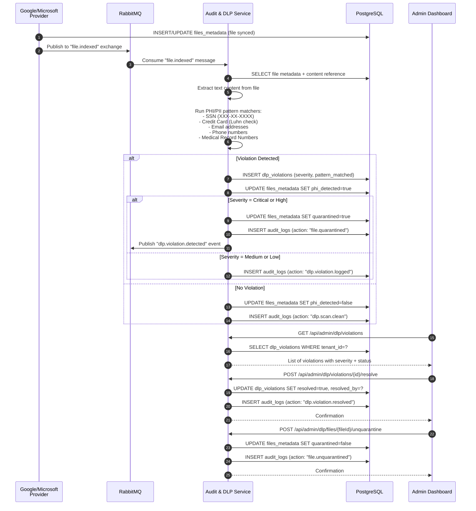
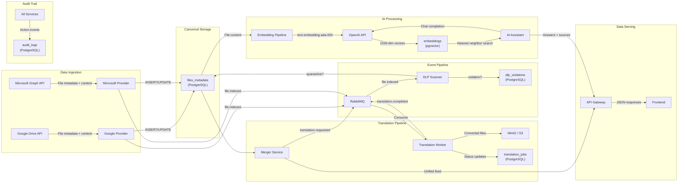

# Center Point Inbox -- Architecture Documentation

## Table of Contents

- [1. System Overview](#1-system-overview)
- [2. High-Level Architecture Diagram](#2-high-level-architecture-diagram)
- [3. Service Descriptions](#3-service-descriptions)
- [4. Sequence Diagrams](#4-sequence-diagrams)
  - [4.1 OAuth Login Flow](#41-oauth-login-flow)
  - [4.2 Unified File Feed](#42-unified-file-feed)
  - [4.3 Translation Flow](#43-translation-flow)
  - [4.4 AI Query Flow](#44-ai-query-flow)
  - [4.5 DLP Scan Flow](#45-dlp-scan-flow)
- [5. Service Communication Patterns](#5-service-communication-patterns)
- [6. Data Flow Diagram](#6-data-flow-diagram)
- [7. Technology Stack](#7-technology-stack)
- [8. Database Schema Overview](#8-database-schema-overview)

---

## 1. System Overview

Center Point Inbox is a multi-tenant SaaS platform that provides a unified, AI-powered document workspace integrating Google Workspace and Microsoft 365. It enables enterprises operating in hybrid cloud environments to browse, translate, search, and govern documents from a single pane of glass.

The platform follows a microservices architecture deployed on Kubernetes, with each service responsible for a distinct business capability. Services communicate via synchronous HTTP (REST) for request-response flows and asynchronous messaging (RabbitMQ) for background work such as document translation and DLP scanning.

### Design Principles

- **Tenant Isolation**: Every database query is scoped to a tenant ID embedded in the JWT. Cross-tenant access is structurally impossible at the data layer.
- **Provider Abstraction**: Google and Microsoft are pluggable providers behind a unified Merger Service, so adding future providers (Dropbox, Box) requires no frontend changes.
- **Compliance by Default**: DLP scanning, audit logging, and PHI detection are built into the core pipeline rather than bolted on as afterthoughts.
- **Stateless Services**: All backend services are stateless and horizontally scalable. Session state lives in Redis; persistent state lives in PostgreSQL and S3/MinIO.

---

## 2. High-Level Architecture Diagram

```mermaid
graph TB
    subgraph Clients["Clients"]
        Browser["Browser (React/Next.js)"]
        MobileApp["Mobile App (Future)"]
        APIConsumer["API Consumer"]
    end

    subgraph Frontend["Frontend -- Next.js 14"]
        NextApp["Next.js App Router<br/>React 18 + TanStack Query<br/>Zustand + Tailwind CSS"]
    end

    subgraph Gateway["API Gateway Layer"]
        APIGateway["API Gateway<br/>.NET 8 / Port 5000<br/>JWT Validation, Routing,<br/>Rate Limiting, CORS"]
    end

    subgraph BackendServices["Backend Microservices (.NET 8)"]
        AuthService["Auth Service<br/>Port 5001<br/>OAuth2 + JWT Issuance<br/>Token Rotation"]
        GoogleProvider["Google Provider<br/>Port 5002<br/>Google Drive API<br/>Google Docs Export"]
        MicrosoftProvider["Microsoft Provider<br/>Port 5003<br/>OneDrive + SharePoint<br/>Microsoft Graph API"]
        MergerService["Merger Service<br/>Port 5004<br/>Unified File Feed<br/>Cross-Provider Merge"]
        TranslationWorker["Translation Worker<br/>(No HTTP port)<br/>Format Conversion<br/>RabbitMQ Consumer"]
        AiAssistant["AI Assistant<br/>Port 5006<br/>Semantic Search<br/>Summarization + Q&A"]
        AuditDlp["Audit & DLP Service<br/>Port 5007<br/>Audit Logging<br/>PHI/PII Detection"]
    end

    subgraph DataStores["Data Stores"]
        PostgreSQL["PostgreSQL 16<br/>+ pgvector Extension<br/>Port 5432"]
        Redis["Redis 7<br/>Session Cache + Rate Limits<br/>Port 6379"]
        RabbitMQ["RabbitMQ 3<br/>Task Queues<br/>Ports 5672 / 15672"]
        MinIO["MinIO (S3-Compatible)<br/>Translation Output Storage<br/>Ports 9000 / 9001"]
    end

    subgraph ExternalAPIs["External APIs"]
        GoogleAPI["Google APIs<br/>Drive API v3<br/>Docs/Sheets/Slides Export"]
        MicrosoftAPI["Microsoft Graph API<br/>OneDrive + SharePoint<br/>File Content + Metadata"]
        OpenAI["OpenAI API<br/>GPT-4o (Chat)<br/>text-embedding-ada-002"]
    end

    Browser --> NextApp
    MobileApp -.-> APIGateway
    APIConsumer -.-> APIGateway
    NextApp -->|"REST /api/*"| APIGateway

    APIGateway -->|"/api/auth/*"| AuthService
    APIGateway -->|"/api/files"| MergerService
    APIGateway -->|"/api/files/google/*"| GoogleProvider
    APIGateway -->|"/api/files/microsoft/*"| MicrosoftProvider
    APIGateway -->|"/api/translate/*"| MergerService
    APIGateway -->|"/api/ai/*"| AiAssistant
    APIGateway -->|"/api/audit/*"| AuditDlp
    APIGateway -->|"/api/admin/*"| AuditDlp

    MergerService -->|"HTTP"| GoogleProvider
    MergerService -->|"HTTP"| MicrosoftProvider
    MergerService -->|"Publish: translation.requested"| RabbitMQ

    TranslationWorker -->|"Consume: translation.requested"| RabbitMQ
    TranslationWorker -->|"Store translated files"| MinIO
    TranslationWorker -->|"Publish: translation.completed"| RabbitMQ

    AuditDlp -->|"Consume: file.indexed"| RabbitMQ
    AuditDlp -->|"Publish: dlp.violation.detected"| RabbitMQ

    AuthService -->|"OAuth2 Authorization Code"| GoogleAPI
    AuthService -->|"OAuth2 Authorization Code"| MicrosoftAPI
    GoogleProvider -->|"Drive API v3"| GoogleAPI
    MicrosoftProvider -->|"Graph API"| MicrosoftAPI
    AiAssistant -->|"Embeddings + Chat Completions"| OpenAI

    AuthService --> PostgreSQL
    AuthService --> Redis
    GoogleProvider --> PostgreSQL
    MicrosoftProvider --> PostgreSQL
    MergerService --> PostgreSQL
    AiAssistant --> PostgreSQL
    AuditDlp --> PostgreSQL
    TranslationWorker --> PostgreSQL

    APIGateway --> Redis

    classDef frontend fill:#3b82f6,stroke:#1d4ed8,color:#fff
    classDef gateway fill:#8b5cf6,stroke:#6d28d9,color:#fff
    classDef service fill:#10b981,stroke:#059669,color:#fff
    classDef datastore fill:#f59e0b,stroke:#d97706,color:#fff
    classDef external fill:#ef4444,stroke:#dc2626,color:#fff
    classDef client fill:#6b7280,stroke:#4b5563,color:#fff

    class Browser,MobileApp,APIConsumer client
    class NextApp frontend
    class APIGateway gateway
    class AuthService,GoogleProvider,MicrosoftProvider,MergerService,TranslationWorker,AiAssistant,AuditDlp service
    class PostgreSQL,Redis,RabbitMQ,MinIO datastore
    class GoogleAPI,MicrosoftAPI,OpenAI external
```

---

## 3. Service Descriptions

| Service | Port | Responsibility | Dependencies |
|---------|------|----------------|--------------|
| **API Gateway** | 5000 | JWT validation, request routing, rate limiting, CORS enforcement | Redis, Auth Service, all downstream services |
| **Auth Service** | 5001 | OAuth2 authorization code flow with Google/Microsoft, JWT issuance and refresh, token encryption at rest, session management | PostgreSQL, Redis, RabbitMQ, Google/Microsoft OAuth |
| **Google Provider** | 5002 | Google Drive file listing, metadata sync, file download, Docs/Sheets/Slides export | PostgreSQL, RabbitMQ, Google Drive API |
| **Microsoft Provider** | 5003 | OneDrive/SharePoint file listing, metadata sync, file download | PostgreSQL, RabbitMQ, Microsoft Graph API |
| **Merger Service** | 5004 | Unified file feed aggregation across providers, cross-provider search, translation job dispatch | PostgreSQL, RabbitMQ, Google Provider, Microsoft Provider |
| **Translation Worker** | -- | Background worker consuming translation jobs from RabbitMQ, format conversion (DOCX to PDF, Sheets to CSV, etc.), output storage to S3/MinIO | PostgreSQL, RabbitMQ, MinIO |
| **AI Assistant** | 5006 | Semantic search over document embeddings (pgvector), document summarization, natural language Q&A with source attribution | PostgreSQL, RabbitMQ, OpenAI API |
| **Audit & DLP** | 5007 | Immutable audit log recording, DLP policy enforcement, PHI/PII pattern scanning, file quarantine management | PostgreSQL, RabbitMQ |
| **Frontend** | 3000 | Next.js 14 App Router SPA with server-side rendering, Zustand state management, TanStack Query for data fetching | API Gateway |

---

## 4. Sequence Diagrams

### 4.1 OAuth Login Flow

### 4.2 Unified File Feed

### 4.3 Translation Flow

### 4.4 AI Query Flow

### 4.5 DLP Scan Flow

---

## 5. Service Communication Patterns

| Source | Destination | Protocol | Pattern | Exchange/Queue | Description |
|--------|------------|----------|---------|----------------|-------------|
| Frontend | API Gateway | HTTPS | Request-Response | -- | All client API calls route through the gateway |
| API Gateway | Auth Service | HTTP | Request-Response | -- | Login, token refresh, token revocation, user profile |
| API Gateway | Merger Service | HTTP | Request-Response | -- | Unified file listing, translation job creation |
| API Gateway | Google Provider | HTTP | Request-Response | -- | Direct Google file operations (download, export) |
| API Gateway | Microsoft Provider | HTTP | Request-Response | -- | Direct Microsoft file operations (download) |
| API Gateway | AI Assistant | HTTP | Request-Response | -- | AI queries, summarization, semantic search |
| API Gateway | Audit & DLP | HTTP | Request-Response | -- | Audit log retrieval, DLP dashboard, admin operations |
| Merger Service | Google Provider | HTTP | Request-Response | -- | Fetch Google files for unified feed |
| Merger Service | Microsoft Provider | HTTP | Request-Response | -- | Fetch Microsoft files for unified feed |
| Merger Service | RabbitMQ | AMQP | Publish | `translation.requested` | Dispatch translation jobs |
| Translation Worker | RabbitMQ | AMQP | Consume | `translation.requested` | Pick up translation jobs |
| Translation Worker | RabbitMQ | AMQP | Publish | `translation.completed` | Signal job completion |
| Translation Worker | RabbitMQ | AMQP | Publish | `file.indexed` | Trigger DLP scan on translated output |
| Translation Worker | MinIO | HTTP (S3) | Request-Response | -- | Store translated file output |
| Google Provider | RabbitMQ | AMQP | Publish | `file.indexed` | Trigger DLP scan after file sync |
| Microsoft Provider | RabbitMQ | AMQP | Publish | `file.indexed` | Trigger DLP scan after file sync |
| Audit & DLP | RabbitMQ | AMQP | Consume | `file.indexed` | DLP scanning pipeline |
| Audit & DLP | RabbitMQ | AMQP | Publish | `dlp.violation.detected` | Alert on DLP violations |
| AI Assistant | OpenAI | HTTPS | Request-Response | -- | Embedding generation and chat completions |
| Auth Service | Google OAuth | HTTPS | Request-Response | -- | OAuth2 authorization code exchange |
| Auth Service | Microsoft OAuth | HTTPS | Request-Response | -- | OAuth2 authorization code exchange |
| All Services | PostgreSQL | TCP | Request-Response | -- | Persistent data storage |
| API Gateway, Auth | Redis | TCP | Request-Response | -- | Caching, sessions, rate limit counters |

---

## 6. Data Flow Diagram

---

## 7. Technology Stack

### Backend

| Layer | Technology | Version | Purpose |
|-------|-----------|---------|---------|
| Runtime | .NET 8 (ASP.NET Core) | 8.0 | All backend microservices |
| Database | PostgreSQL | 16 (Alpine) | Primary relational data store |
| Vector DB | pgvector extension | -- | Semantic search embeddings (1536-dim) |
| Cache | Redis | 7 (Alpine) | Session cache, rate limiting, query caching |
| Message Queue | RabbitMQ | 3 (Management Alpine) | Async job dispatch, event publishing |
| Object Storage | MinIO (S3-compatible) | Latest | Translation output, file cache |
| Containerization | Docker | Multi-stage builds | Service packaging |
| Orchestration | Kubernetes | v1.27+ | Production deployment, scaling |
| Ingress | NGINX Ingress Controller | -- | TLS termination, rate limiting, routing |

### Frontend

| Layer | Technology | Version | Purpose |
|-------|-----------|---------|---------|
| Framework | Next.js (App Router) | 14.2.15 | SSR + SPA with file-based routing |
| UI Library | React | 18.3 | Component rendering |
| State Management | Zustand | 5.0 | Client-side global state |
| Data Fetching | TanStack Query | 5.59 | Server state, caching, refetching |
| HTTP Client | Axios | 1.7 | API communication |
| Styling | Tailwind CSS | 3.4 | Utility-first CSS |
| Components | Radix UI | Various | Accessible primitives (Dialog, Dropdown, Tabs, Toast) |
| Icons | Lucide React | 0.451 | SVG icon set |
| Date Utilities | date-fns | 4.1 | Date formatting and manipulation |

### External APIs

| Provider | API | Purpose |
|----------|-----|---------|
| Google | Drive API v3 | File listing, download, export |
| Google | OAuth 2.0 | User authentication |
| Microsoft | Graph API | OneDrive/SharePoint file access |
| Microsoft | OAuth 2.0 (MSAL) | User authentication |
| OpenAI | Chat Completions (GPT-4o) | Natural language Q&A, summarization |
| OpenAI | Embeddings (text-embedding-ada-002) | Semantic vector generation |

---

## 8. Database Schema Overview

The PostgreSQL database uses the following core tables, all scoped to tenant isolation:

| Table | Purpose | Key Fields |
|-------|---------|------------|
| `tenants` | Multi-tenant organization units | id, slug, subscription_tier, settings (JSONB) |
| `users` | User accounts scoped to tenants | id, email, role (admin/user/viewer), tenant_id |
| `oauth_connections` | Encrypted OAuth tokens per provider | user_id, provider, access_token_encrypted, refresh_token_encrypted |
| `files_metadata` | Canonical file records from all providers | provider, provider_file_id, phi_detected, quarantined, tenant_id |
| `translation_jobs` | Document format conversion tracking | source_file_id, source_format, target_format, status, output_storage_path |
| `audit_logs` | Immutable, append-only action log | action, resource_type, resource_id, ip_address, metadata (JSONB) |
| `dlp_violations` | PHI/PII detection records | violation_type, severity, pattern_matched, resolved |
| `embeddings` | pgvector semantic search vectors | file_id, chunk_index, chunk_text, embedding (vector 1536) |

### Key Indexes

- **IVFFlat cosine index** on `embeddings.embedding` for approximate nearest-neighbor search
- **Partial indexes** on `files_metadata.phi_detected` and `files_metadata.quarantined` for fast DLP queries
- **Composite index** on `audit_logs (tenant_id, created_at DESC)` for time-ordered audit trail retrieval
- **Unique constraint** on `(tenant_id, provider, provider_file_id)` preventing duplicate file records

### Extensions

- `pgcrypto` -- UUID generation via `gen_random_uuid()`
- `vector` (pgvector) -- 1536-dimensional vector storage and cosine distance search
