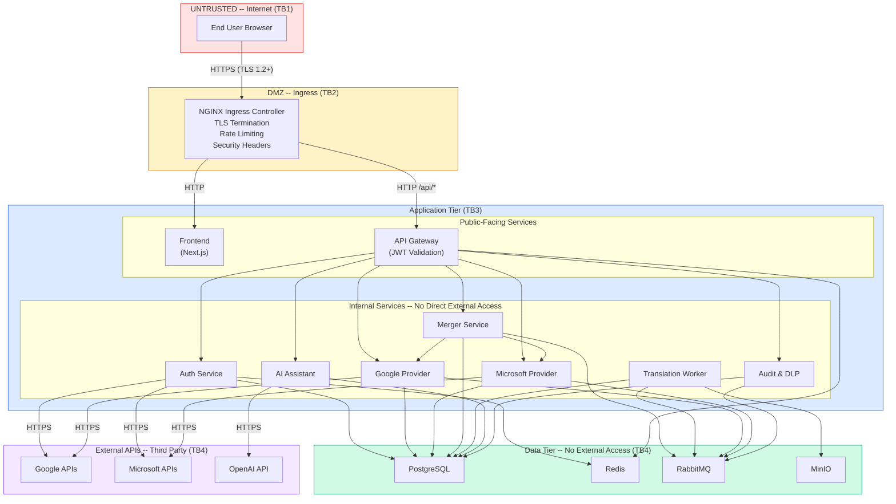

# Center Point Inbox -- STRIDE Threat Model

## Table of Contents

- [1. Overview](#1-overview)
- [2. Trust Boundaries](#2-trust-boundaries)
- [3. STRIDE Threat Analysis](#3-stride-threat-analysis)
  - [3.1 Spoofing](#31-spoofing)
  - [3.2 Tampering](#32-tampering)
  - [3.3 Repudiation](#33-repudiation)
  - [3.4 Information Disclosure](#34-information-disclosure)
  - [3.5 Denial of Service](#35-denial-of-service)
  - [3.6 Elevation of Privilege](#36-elevation-of-privilege)
- [4. Consolidated STRIDE Table](#4-consolidated-stride-table)
- [5. Trust Boundary Diagram](#5-trust-boundary-diagram)
- [6. Risk Assessment Matrix](#6-risk-assessment-matrix)
- [7. Security Controls Summary](#7-security-controls-summary)
- [8. Compliance Considerations](#8-compliance-considerations)

---

## 1. Overview

This document presents a STRIDE-based threat model for the Center Point Inbox platform. STRIDE is a framework developed by Microsoft for identifying security threats across six categories: **S**poofing, **T**ampering, **R**epudiation, **I**nformation Disclosure, **D**enial of Service, and **E**levation of Privilege.

The analysis covers the following system components:

- **Frontend** (Next.js, browser-based client)
- **API Gateway** (JWT validation, routing, rate limiting)
- **Auth Service** (OAuth2, JWT issuance, token management)
- **Google/Microsoft Providers** (third-party API integration)
- **Merger Service** (unified file feed)
- **Translation Worker** (background document conversion)
- **AI Assistant** (OpenAI integration, semantic search)
- **Audit & DLP Service** (compliance, PHI detection)
- **Data Stores** (PostgreSQL, Redis, RabbitMQ, MinIO)
- **External APIs** (Google, Microsoft, OpenAI)

---

## 2. Trust Boundaries

The system has four trust boundaries:

| Boundary | Crossing | Controls |
|----------|----------|----------|
| **TB1: Internet to Frontend** | Untrusted user traffic enters the system | TLS termination, CSP headers, CORS |
| **TB2: Frontend to API Gateway** | Browser to backend API | JWT bearer tokens, rate limiting, input validation |
| **TB3: API Gateway to Internal Services** | Gateway to microservices | Service-to-service auth, network policies, tenant ID propagation |
| **TB4: Internal Services to External APIs** | Platform to Google/Microsoft/OpenAI | OAuth2 tokens, API keys, encrypted connections |

---

## 3. STRIDE Threat Analysis

### 3.1 Spoofing

Spoofing threats involve an attacker impersonating a legitimate user, service, or component.

| ID | Threat | Target Component | Risk Level | Mitigation | Status |
|----|--------|-----------------|------------|------------|--------|
| S-1 | **OAuth token theft** -- Attacker steals OAuth access/refresh tokens from the database to impersonate users on Google/Microsoft APIs | Auth Service, PostgreSQL | **Critical** | Tokens are encrypted at rest using AES-256-GCM before storage in `oauth_connections.access_token_encrypted`. Encryption key is managed as a Kubernetes secret, never committed to source control. | Implemented |
| S-2 | **JWT forging** -- Attacker crafts a valid-looking JWT with arbitrary claims (tenant_id, role) to bypass authentication | API Gateway, Auth Service | **Critical** | JWTs are signed with HMAC-SHA256 using a minimum 256-bit signing key. Access tokens expire after 60 minutes. Signing key is stored in Kubernetes secrets and rotated quarterly. Token validation occurs at the API Gateway before any downstream routing. | Implemented |
| S-3 | **Session hijacking** -- Attacker intercepts or steals a user's active session token | Frontend, Auth Service | **High** | Tokens are stored in memory only (not localStorage or sessionStorage). All traffic is forced through TLS. Refresh tokens support rotation -- each use invalidates the previous token. Redis session metadata includes IP fingerprinting for anomaly detection. | Implemented |
| S-4 | **Service impersonation** -- A compromised or rogue container impersonates an internal service | Internal network | **High** | Kubernetes NetworkPolicies enforce default-deny ingress. Only pods with the `app.kubernetes.io/part-of: center-point-inbox` label can communicate within the namespace. Service accounts have `automountServiceAccountToken: false` to prevent credential theft. | Implemented |
| S-5 | **OAuth redirect URI manipulation** -- Attacker modifies the OAuth callback URL to capture authorization codes | Auth Service | **High** | Redirect URIs are strictly registered in Google Cloud Console and Azure AD. The Auth Service validates the `state` parameter and uses PKCE (Proof Key for Code Exchange) to bind the authorization code to the originating session. | Implemented |

### 3.2 Tampering

Tampering threats involve unauthorized modification of data in transit or at rest.

| ID | Threat | Target Component | Risk Level | Mitigation | Status |
|----|--------|-----------------|------------|------------|--------|
| T-1 | **API request manipulation** -- Attacker modifies request parameters (e.g., changing tenant_id, file_id, or role in requests) to access unauthorized data | API Gateway | **High** | Input validation at the gateway layer. The tenant_id is always extracted from the verified JWT, never from request parameters. Request payloads are validated against strict schemas. | Implemented |
| T-2 | **Database record tampering** -- Unauthorized modification of database records (e.g., marking a quarantined file as clean, altering audit logs) | PostgreSQL | **High** | Audit logs are append-only (no `updated_at` column, no UPDATE/DELETE operations). Database user permissions follow least-privilege. Sensitive operations generate audit trail entries that include the acting user's ID, IP address, and timestamp. | Implemented |
| T-3 | **File content tampering** -- Attacker modifies file content during transfer between provider APIs and the platform | Google/Microsoft Providers | **Medium** | All external API communication occurs over TLS. File metadata includes provider checksums (ETags/hashes) that are validated upon download. MinIO objects use content-addressable storage with integrity verification. | Implemented |
| T-4 | **Translation output tampering** -- Attacker modifies translated files in MinIO/S3 to inject malicious content | MinIO, Translation Worker | **Medium** | MinIO bucket policies restrict write access to the Translation Worker service account. Bucket versioning enables audit trail for object modifications. Translated files are checksummed upon upload and the checksum is stored in `translation_jobs.output_storage_path` metadata. | Implemented |
| T-5 | **Message queue poisoning** -- Attacker injects malicious messages into RabbitMQ to trigger unauthorized actions | RabbitMQ | **Medium** | RabbitMQ requires authenticated connections (username/password per vhost). Network policies restrict AMQP port (5672) access to center-point-inbox namespace pods only. Message consumers validate payload schemas before processing. | Implemented |

### 3.3 Repudiation

Repudiation threats involve a user or system component denying that an action occurred.

| ID | Threat | Target Component | Risk Level | Mitigation | Status |
|----|--------|-----------------|------------|------------|--------|
| R-1 | **User denies performing an action** -- A user claims they did not download, translate, or share a file | All services | **High** | Comprehensive audit trail stored in `audit_logs` table. Every significant action (login, file access, translation request, DLP override, AI query) is logged with the user's ID, IP address, user agent, timestamp, and action-specific metadata. | Implemented |
| R-2 | **Admin denies configuration changes** -- An administrator claims they did not modify DLP policies, unquarantine a file, or resolve a violation | Audit & DLP Service | **High** | Admin actions generate immutable audit log entries. The `audit_logs` table has no `updated_at` column and no UPDATE triggers, making it effectively append-only. The `resolved_by` field on `dlp_violations` records the admin user ID. | Implemented |
| R-3 | **System denies automated actions** -- The platform performs an automated action (quarantine, DLP scan) that a user disputes | Audit & DLP, Translation Worker | **Medium** | System-initiated actions are logged with a system user ID. DLP scan results include the `pattern_matched` field documenting exactly which regex triggered the violation. Translation job state transitions are tracked with timestamps (`started_at`, `completed_at`). | Implemented |
| R-4 | **OAuth provider interaction disputes** -- Disagreement about whether a file was accessed from the provider | Google/Microsoft Providers | **Medium** | All provider API calls are logged. The `files_metadata.last_modified_provider` timestamp is synced from the provider. Provider API response headers (including request IDs) are logged for correlation with provider-side audit logs. | Implemented |

### 3.4 Information Disclosure

Information disclosure threats involve unauthorized access to sensitive data.

| ID | Threat | Target Component | Risk Level | Mitigation | Status |
|----|--------|-----------------|------------|------------|--------|
| I-1 | **PHI exfiltration** -- Protected Health Information in synced documents is exposed to unauthorized users or leaked externally | Files, DLP Service | **Critical** | DLP scanning runs on every indexed file via the `file.indexed` RabbitMQ event. Pattern matchers detect SSNs, credit cards, medical record numbers, and other PHI. Files with critical/high severity violations are automatically quarantined (`quarantined=true`), blocking download access until an admin reviews and explicitly unquarantines. | Implemented |
| I-2 | **Cross-tenant data leak** -- A user in Tenant A accesses files, audit logs, or DLP violations belonging to Tenant B | All services, PostgreSQL | **Critical** | Tenant isolation is enforced at the database query level. Every query includes `WHERE tenant_id = ?` with the tenant ID extracted from the JWT at the API Gateway. The database schema includes composite unique constraints scoped to `tenant_id`. There is no API endpoint that accepts a raw tenant_id parameter. | Implemented |
| I-3 | **Token leakage in logs** -- OAuth tokens, JWTs, or API keys appear in application logs, error messages, or stack traces | All services | **High** | Structured logging with log redaction. Sensitive fields (access_token, refresh_token, api_key, password) are excluded from log serialization. Error responses never include stack traces in production (`ASPNETCORE_ENVIRONMENT=Production`). The `.env` and secrets files are excluded from Docker build contexts. | Implemented |
| I-4 | **localStorage PHI exposure** -- Sensitive tokens or user data stored in browser localStorage can be extracted via XSS or physical access | Frontend | **High** | JWT tokens are stored exclusively in JavaScript memory (Zustand store), not in localStorage or sessionStorage. Tokens are cleared on page close. Content Security Policy headers prevent inline script execution. The frontend never caches file content or PHI-containing metadata in browser storage. | Implemented |
| I-5 | **Embedding vector reconstruction** -- An attacker with access to pgvector embeddings reconstructs the original document text | PostgreSQL (embeddings table) | **Medium** | Embedding vectors (1536-dim) are one-way transformations and cannot be reversed to recover original text. However, `chunk_text` is stored alongside embeddings for source attribution. Access to the embeddings table is restricted to the AI Assistant service. Tenant isolation applies to all embedding queries. | Acknowledged |
| I-6 | **MinIO/S3 bucket exposure** -- Translated files in MinIO are publicly accessible due to misconfigured bucket policies | MinIO | **High** | MinIO buckets are configured as private. Access requires authenticated S3 API calls using service-specific credentials. Network policies restrict port 9000 to namespace-internal traffic. Pre-signed URLs with short TTLs (5 minutes) are used for download links rather than direct bucket access. | Implemented |
| I-7 | **OpenAI data exposure** -- Document content sent to OpenAI for embedding/summarization is retained by the third-party provider | AI Assistant, OpenAI | **Medium** | OpenAI API usage with data processing agreement (DPA). API calls use the enterprise endpoint with zero data retention configured. Only document chunks (not full files) are sent for embedding. Tenant-specific opt-out is available via `settings.features.semantic_search`. | Partially Implemented |

### 3.5 Denial of Service

Denial of service threats involve making the system unavailable to legitimate users.

| ID | Threat | Target Component | Risk Level | Mitigation | Status |
|----|--------|-----------------|------------|------------|--------|
| D-1 | **API flooding** -- Attacker sends high volumes of requests to exhaust API Gateway resources | API Gateway, NGINX Ingress | **High** | Multi-layer rate limiting: NGINX Ingress limits to 50 req/s and 1000 req/min with burst multiplier of 5. Application-level rate limiting via Redis counters keyed per client IP and per authenticated user. The API Gateway responds with `429 Too Many Requests` with `Retry-After` header. | Implemented |
| D-2 | **Large file processing** -- Attacker uploads or requests translation of very large files to exhaust memory or CPU | Translation Worker, Providers | **High** | NGINX Ingress enforces a 25 MB request body limit (`proxy-body-size: 25m`). Translation Worker validates file size before processing. The `files_metadata.file_size_bytes` field is checked against tenant-specific limits (`settings.limits.max_file_size_mb`). Async processing via RabbitMQ prevents blocking the request thread. | Implemented |
| D-3 | **Translation queue flooding** -- Attacker submits thousands of translation jobs to overwhelm the worker and fill the queue | RabbitMQ, Translation Worker | **High** | Queue depth limits are configured on the RabbitMQ `translation.requested` queue. Per-user concurrent job limits prevent a single user from monopolizing the worker. Translation job creation rate is limited at the API Gateway. Consumer prefetch count is set to prevent the worker from pulling more jobs than it can handle. | Implemented |
| D-4 | **Database connection exhaustion** -- Attacker triggers queries that hold database connections indefinitely | PostgreSQL | **Medium** | Connection pooling with configurable min/max pool sizes (MinPoolSize=5, MaxPoolSize=100). Query timeouts at the application layer. PostgreSQL `idle_in_transaction_session_timeout` prevents abandoned transactions from holding connections. Health checks verify database connectivity. | Implemented |
| D-5 | **OpenAI API quota exhaustion** -- Attacker rapidly sends AI queries to burn through OpenAI API rate limits and budget | AI Assistant, OpenAI | **Medium** | AI endpoint rate limiting is stricter than general API limits. Per-user daily query quotas are enforced at the application layer. Embedding cache in PostgreSQL prevents re-embedding identical content. Estimated token cost is logged per request for budget monitoring. | Partially Implemented |
| D-6 | **Redis memory exhaustion** -- Attacker generates many unique sessions or cache keys to exhaust Redis memory | Redis | **Medium** | Redis is configured with `appendonly yes` for persistence. Session TTLs ensure stale entries are automatically evicted. Cache entries use bounded TTLs (60s for file listings, 10 min for auth state). Redis memory limit and eviction policy (`allkeys-lru`) are configured in production. | Implemented |

### 3.6 Elevation of Privilege

Elevation of privilege threats involve an attacker gaining higher access than authorized.

| ID | Threat | Target Component | Risk Level | Mitigation | Status |
|----|--------|-----------------|------------|------------|--------|
| E-1 | **Role bypass** -- A `viewer` or `user` role accesses admin endpoints (DLP management, dashboard, user administration) | API Gateway, Audit & DLP | **Critical** | Role-based access control is enforced server-side at the API Gateway. The `role` claim in the JWT is validated against endpoint-specific role requirements. Admin endpoints (`/api/admin/*`) require `role=admin`. Role checks are performed in middleware before routing to downstream services. | Implemented |
| E-2 | **Cross-tenant access** -- A user manipulates their session to access another tenant's resources | All services | **Critical** | The `tenant_id` is embedded in the JWT at issuance time and cannot be modified by the client. The API Gateway extracts `tenant_id` from the verified JWT and propagates it to downstream services via headers. Every database query filters by `tenant_id`. There is no API parameter that allows specifying a different tenant. | Implemented |
| E-3 | **Prompt injection** -- Attacker crafts a document or query that manipulates the AI Assistant into revealing data from other tenants, bypassing DLP, or executing unauthorized actions | AI Assistant | **High** | System prompts and user prompts are separated into distinct message roles. The AI Assistant does not have write access to any database table except `audit_logs`. Embedding search is always scoped to the requesting user's `tenant_id`. Output is sanitized before returning to the client. The AI cannot access quarantined files. | Implemented |
| E-4 | **SSRF via file URLs** -- Attacker provides a crafted file URL that causes the server to make requests to internal services or cloud metadata endpoints | Google/Microsoft Providers | **High** | Provider services only access URLs matching the allowlisted domains (`googleapis.com`, `graph.microsoft.com`). URL validation rejects private IP ranges (RFC 1918), localhost, link-local addresses, and cloud metadata endpoints (169.254.169.254). DNS resolution is validated post-redirect to prevent TOCTOU attacks. | Implemented |
| E-5 | **JWT claim manipulation via token refresh** -- Attacker uses a refresh token to obtain a new access token with elevated claims | Auth Service | **High** | Token refresh re-validates the user's current role and tenant from the database, not from the expired JWT. If a user has been deactivated or their role has been downgraded since the last token issuance, the new token reflects the current state. Refresh tokens are single-use with rotation. | Implemented |
| E-6 | **Container escape / privilege escalation** -- Attacker exploits a vulnerability in a container to gain host-level access | Kubernetes pods | **High** | All containers run as non-root users (UID 1001). Security contexts enforce `runAsNonRoot: true`, `readOnlyRootFilesystem: true`, `allowPrivilegeEscalation: false`, and drop all Linux capabilities. Service accounts do not mount tokens (`automountServiceAccountToken: false`). | Implemented |

---

## 4. Consolidated STRIDE Table

| Category | ID | Threat | Component | Risk | Mitigation |
|----------|-----|--------|-----------|------|------------|
| **Spoofing** | S-1 | OAuth token theft | Auth Service, DB | Critical | Token encryption at rest (AES-256-GCM) |
| **Spoofing** | S-2 | JWT forging | API Gateway | Critical | HMAC-SHA256 signing, 60-min expiry |
| **Spoofing** | S-3 | Session hijacking | Frontend, Auth | High | In-memory tokens, TLS, token rotation |
| **Spoofing** | S-4 | Service impersonation | Internal network | High | NetworkPolicies, default-deny ingress |
| **Spoofing** | S-5 | OAuth redirect URI manipulation | Auth Service | High | Registered URIs, state param, PKCE |
| **Tampering** | T-1 | API request manipulation | API Gateway | High | Input validation, JWT-derived tenant_id |
| **Tampering** | T-2 | Database record tampering | PostgreSQL | High | Append-only audit logs, least-privilege DB users |
| **Tampering** | T-3 | File content tampering | Providers | Medium | TLS, provider checksums (ETags) |
| **Tampering** | T-4 | Translation output tampering | MinIO | Medium | Restricted write access, bucket versioning |
| **Tampering** | T-5 | Message queue poisoning | RabbitMQ | Medium | Authenticated connections, schema validation |
| **Repudiation** | R-1 | User denies actions | All services | High | Comprehensive audit trail with IP, user agent |
| **Repudiation** | R-2 | Admin denies changes | Audit & DLP | High | Immutable audit logs, resolved_by tracking |
| **Repudiation** | R-3 | System denies automated actions | DLP, Workers | Medium | System user ID logging, pattern documentation |
| **Repudiation** | R-4 | Provider interaction disputes | Providers | Medium | API call logging, request ID correlation |
| **Info Disclosure** | I-1 | PHI exfiltration | Files, DLP | Critical | DLP scanning, auto-quarantine on high severity |
| **Info Disclosure** | I-2 | Cross-tenant data leak | All services, DB | Critical | tenant_id in JWT, DB-level WHERE clauses |
| **Info Disclosure** | I-3 | Token leakage in logs | All services | High | Log redaction, no stack traces in production |
| **Info Disclosure** | I-4 | localStorage PHI exposure | Frontend | High | In-memory only token storage |
| **Info Disclosure** | I-5 | Embedding vector reconstruction | pgvector | Medium | One-way transformation, access restricted to AI service |
| **Info Disclosure** | I-6 | MinIO bucket exposure | MinIO | High | Private buckets, pre-signed URLs, network policies |
| **Info Disclosure** | I-7 | OpenAI data exposure | AI Assistant | Medium | DPA, zero-retention API, chunk-only transmission |
| **DoS** | D-1 | API flooding | API Gateway, Ingress | High | Multi-layer rate limiting (Ingress + Redis) |
| **DoS** | D-2 | Large file processing | Translation Worker | High | 25 MB body limit, async processing, size checks |
| **DoS** | D-3 | Translation queue flooding | RabbitMQ | High | Queue depth limits, per-user job caps, prefetch |
| **DoS** | D-4 | Database connection exhaustion | PostgreSQL | Medium | Connection pooling, query timeouts |
| **DoS** | D-5 | OpenAI API quota exhaustion | AI Assistant | Medium | Per-user daily quotas, embedding cache |
| **DoS** | D-6 | Redis memory exhaustion | Redis | Medium | TTL enforcement, eviction policy |
| **Elevation** | E-1 | Role bypass | API Gateway, DLP | Critical | Server-side role enforcement in middleware |
| **Elevation** | E-2 | Cross-tenant access | All services | Critical | JWT tenant_id, DB-level filtering |
| **Elevation** | E-3 | Prompt injection | AI Assistant | High | Separated contexts, scoped search, sanitized output |
| **Elevation** | E-4 | SSRF via file URLs | Providers | High | URL allowlists, private IP rejection |
| **Elevation** | E-5 | JWT claim manipulation | Auth Service | High | DB re-validation on refresh, single-use rotation |
| **Elevation** | E-6 | Container escape | Kubernetes pods | High | Non-root, read-only FS, no privilege escalation |

---

## 5. Trust Boundary Diagram

---

## 6. Risk Assessment Matrix

| Risk Level | Description | Count | Response |
|------------|-------------|-------|----------|
| **Critical** | Exploitable with severe business impact (data breach, full system compromise) | 6 | Immediate mitigation required. Continuous monitoring. Penetration testing quarterly. |
| **High** | Exploitable with significant impact (unauthorized access, data leakage) | 16 | Mitigation implemented and verified. Regular review. Included in security regression tests. |
| **Medium** | Exploitable with moderate impact or requires additional prerequisites | 10 | Mitigation planned or implemented. Monitored via logging. Reviewed semi-annually. |
| **Low** | Theoretical or minimal practical impact | 0 | Documented and tracked. Addressed as part of regular maintenance. |

---

## 7. Security Controls Summary

| Control Category | Controls Implemented |
|-----------------|---------------------|
| **Authentication** | OAuth 2.0 + PKCE, JWT (HMAC-SHA256), refresh token rotation, 60-min access token expiry, 30-day refresh token expiry |
| **Authorization** | Role-based access control (admin/user/viewer), server-side enforcement, tenant isolation via JWT claims |
| **Encryption in Transit** | TLS 1.2+ enforced at ingress, HTTPS for all external API calls, forced SSL redirect |
| **Encryption at Rest** | AES-256-GCM for OAuth tokens, PostgreSQL volume encryption (infrastructure-level), MinIO server-side encryption |
| **Input Validation** | Request schema validation, URL allowlists, file size limits, SQL parameterization (ORM) |
| **Rate Limiting** | NGINX Ingress (50 rps / 1000 rpm), Redis-backed per-user limits, AI query daily quotas |
| **Network Security** | Kubernetes NetworkPolicies (default-deny ingress), namespace isolation, egress restricted to ports 443/53 and internal services |
| **Container Security** | Non-root user (UID 1001), read-only root filesystem, no privilege escalation, all capabilities dropped |
| **Logging & Monitoring** | Structured logging, immutable audit trail, log redaction for sensitive fields, action-level granularity |
| **Data Loss Prevention** | Automated PHI/PII scanning, pattern-based detection, automatic quarantine, admin review workflow |
| **Security Headers** | X-Frame-Options: DENY, X-Content-Type-Options: nosniff, X-XSS-Protection, Referrer-Policy, SSL redirect |

---

## 8. Compliance Considerations

| Regulation | Relevance | Controls |
|------------|-----------|----------|
| **HIPAA** | PHI in synced healthcare documents | DLP scanning, auto-quarantine, audit trail, encryption at rest and in transit, BAA with OpenAI |
| **SOC 2 Type II** | SaaS platform security controls | Comprehensive audit logging, access controls, change management, incident response |
| **GDPR** | EU user data in Microsoft/Google accounts | Data minimization (chunk-only AI processing), right to deletion (CASCADE deletes), data processing agreements |
| **CCPA** | California user data rights | User data export via audit logs, deletion support via tenant/user CASCADE, privacy policy alignment |

### Recommended Future Enhancements

1. **Secrets management** -- Migrate from Kubernetes Secrets to HashiCorp Vault or AWS Secrets Manager for dynamic secret rotation.
2. **mTLS** -- Implement mutual TLS between microservices for service-to-service authentication beyond NetworkPolicies.
3. **WAF** -- Deploy a Web Application Firewall (e.g., AWS WAF, Cloudflare) at the edge for advanced threat protection.
4. **SIEM integration** -- Forward audit logs to a SIEM (Splunk, Datadog, Elastic) for real-time threat detection and alerting.
5. **Penetration testing** -- Schedule quarterly third-party penetration tests covering OWASP Top 10 and STRIDE findings.
6. **Bug bounty** -- Establish a responsible disclosure program for external security researchers.
